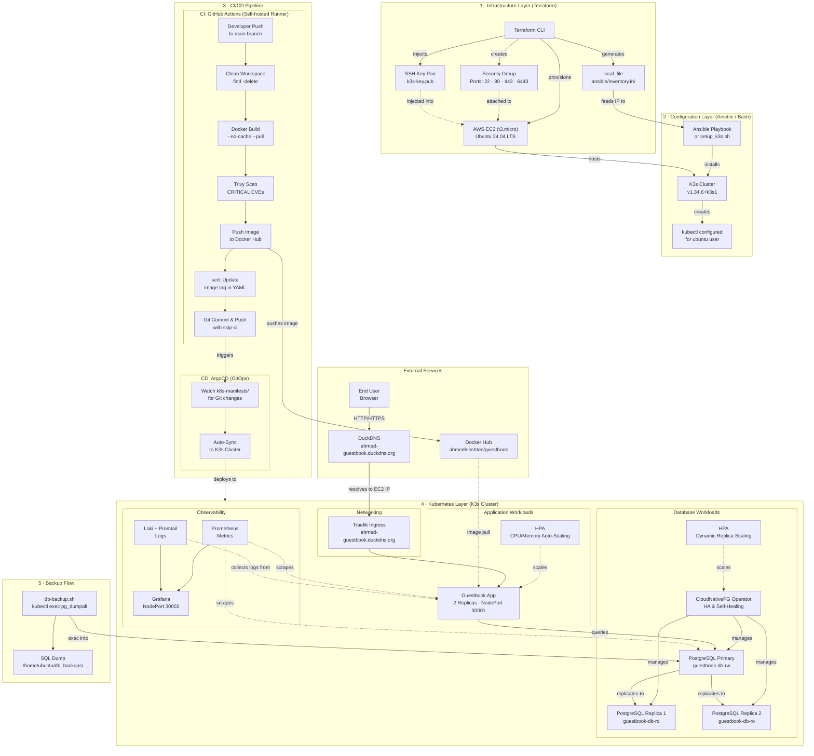

# System Architecture — HyperCloud AI Platform

This document details the end-to-end system design, from AWS infrastructure provisioning to GitOps-driven Kubernetes deployments.

---

## Full System Architecture Diagram



---

## 1. Infrastructure Layer (Terraform)

Terraform provisions all AWS resources using the **default VPC** for simplicity and cost efficiency.

| Resource | Type | Purpose |
|---|---|---|
| `aws_instance.k3s_node` | EC2 `t3.micro` | Unified K3s Control + Worker plane |
| `aws_security_group.k3s_sg` | Security Group | Ingress: 22 (SSH), 80 (HTTP), 443 (HTTPS), 6443 (K3s API). Egress: All |
| `aws_key_pair.deployer` | SSH Key Pair | Injected from local `k3s-key.pub` for secure access |
| `aws_ami.ubuntu` | Data Source | Fetches the latest Ubuntu 24.04 LTS (Noble Numbat) AMI from Canonical |
| `local_file.ansible_inventory` | Local File | Auto-generates `ansible/inventory.ini` with the EC2 Public IP |

**Key Design Decision:** The `local_file` resource uses `replace_triggered_by` to regenerate the Ansible inventory whenever the EC2 Public IP changes (e.g., after a stop/start cycle).

### Outputs

| Output | Description |
|---|---|
| `ec2_public_ip` | The dynamically assigned Public IP of the EC2 instance |

---

## 2. Configuration Layer (Ansible / Bash)

The node is configured using either the **Ansible Playbook** (`playbook.yml`) or the equivalent **Bash Script** (`setup_k3s.sh`) for environments without Ansible (e.g., Windows without WSL).

### Configuration Steps

1. Update `apt` package cache.
2. Install dependencies (`curl`, `ca-certificates`).
3. Install **K3s** via the official installer script (`get.k3s.io`).
4. Set permissions on `/etc/rancher/k3s/k3s.yaml` to `0644`.
5. Copy the kubeconfig to `~/.kube/config` for the `ubuntu` user.
6. Export `KUBECONFIG` in `.bashrc` for persistent `kubectl` access.

---

## 3. Application Layer

### Guestbook Application

| Property | Value |
|---|---|
| **Runtime** | Node.js 18 (Alpine) |
| **Framework** | Express.js |
| **Database Driver** | `pg` (node-postgres) |
| **Port** | 3000 |

The application connects to the PostgreSQL cluster managed by **CloudNativePG** via the Kubernetes internal DNS name `guestbook-db-rw`. Database credentials are injected via Kubernetes Secrets (`guestbook-db-app`).

### Containerization

The Dockerfile uses a single-stage build on `node:18-alpine`:
1. Copies `package*.json` and runs `npm install`.
2. Copies the application source.
3. Exposes port `3000` and runs `node app.js`.

---

## 4. Kubernetes Orchestration Layer (K3s)

### Workloads

| Manifest | Kind | Details |
|---|---|---|
| `app-deployment.yml` | Deployment | 2 replicas, `imagePullPolicy: Always`, resource limits (200m CPU / 256Mi Memory) |
| `app-deployment.yml` | Service | `NodePort` on port `30001`, maps port 80 → 3000 |
| `postgres-cluster.yml` | CNPG Cluster | 3-instance PostgreSQL 15 HA cluster, 2Gi storage each |
| `ingress.yml` | Ingress | Routes `ahmed-guestbook.duckdns.org` → `guestbook-service:80` via Traefik |

### Database High Availability

The **CloudNativePG Operator** manages a 3-node PostgreSQL cluster (`guestbook-db`):
- **1 Primary** (read-write) accessible via `guestbook-db-rw`.
- **2 Replicas** (read-only) accessible via `guestbook-db-ro`.
- Automatic failover and self-healing if the primary pod crashes.

### Database Auto-Scaling (HPA)

- **Horizontal Pod Autoscaler**: Configured to monitor CPU and Memory usage of the database nodes.

- **Dynamic Scaling**: Automatically scales the number of replicas based on real-time traffic load to maintain performance.

- **Resource Efficiency**: Ensures the cluster only uses necessary resources, scaling down during low-traffic periods to optimize cost.

---

## 5. CI/CD Layer

### CI: GitHub Actions (Self-hosted Runner)

The pipeline runs on the **same EC2 instance** as the K3s cluster using a self-hosted GitHub Actions runner.

```
Push to main → Clean → Checkout → Prune Docker → Build → Trivy Scan → Push → Update YAML → Git Push
```

**Key Hardening:**
- `find -mindepth 1 -delete` ensures a truly clean workspace (including `.git`).
- `docker builder prune -af` and `docker image prune -af` prevent stale cache issues.
- `--no-cache --pull` on `docker build` forces a fresh build from scratch.
- Manifest commit uses `[skip ci]` to prevent infinite pipeline loops.

### CD: ArgoCD (GitOps)

ArgoCD is installed on the K3s cluster and configured to watch the `k8s-manifests/` directory of this Git repository. When the CI pipeline pushes an updated image tag to the manifest, ArgoCD automatically detects the drift and syncs the cluster state to match the Git state.

---

## 6. Observability Layer (Monitoring)

Installed via Helm charts using `monitoring/setup_monitoring.sh`:

| Component | Helm Chart | Purpose |
|---|---|---|
| **Prometheus** | `kube-prometheus-stack` | Metrics collection and alerting |
| **Grafana** | `kube-prometheus-stack` | Dashboards and visualization (NodePort `30002`) |
| **Loki** | `loki-stack` | Log aggregation |
| **Promtail** | `loki-stack` | Log collector (ships pod logs to Loki) |

---

## 7. Networking & DNS

| Component | Details |
|---|---|
| **DuckDNS** | Free Dynamic DNS service pointing `ahmed-guestbook.duckdns.org` to the EC2 Public IP |
| **Traefik** | K3s built-in Ingress controller, routes external traffic to internal services |
| **NodePorts** | `30001` (Guestbook App), `30002` (Grafana) |