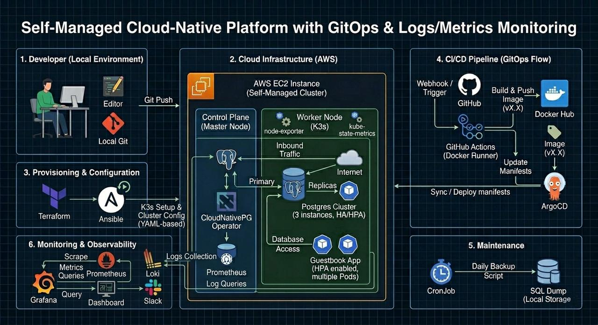

# ☁️ HyperCloud Guestbook Platform — Production DevSecOps on AWS

A production-grade, cloud-native **Guestbook** web application deployed on **AWS** using a full **DevSecOps** and **GitOps** pipeline. The entire infrastructure lifecycle — from provisioning a server to deploying a highly available database — is managed entirely through code.

> **Live URL:** [ahmed-guestbook.duckdns.org](http://ahmed-guestbook.duckdns.org)

---

## 🖼️ System Architecture



---
## 🏗️ Architecture at a Glance

```
Developer Push → GitHub Actions (CI) → Docker Hub → ArgoCD (CD) → K3s Cluster on AWS EC2
```

| Layer | Technology |
|---|---|
| **Infrastructure** | Terraform (AWS EC2, Security Groups) |
| **Configuration** | Ansible Playbooks + Bash Scripts |
| **Container Runtime** | Docker (Build) / containerd (K3s Runtime) |
| **Orchestration** | K3s (Lightweight Kubernetes) |
| **Database** | CloudNativePG Operator (3-node PostgreSQL HA & HPA Cluster) |
| **CI Pipeline** | GitHub Actions (Self-hosted Runner on EC2) |
| **CD Pipeline** | ArgoCD (GitOps — watches `k8s-manifests/` for changes) |
| **Security Scanning** | Trivy (Container Image CVE Scanner) |
| **Ingress & DNS** | Traefik (K3s built-in) + DuckDNS |
| **Monitoring** | Prometheus + Grafana + Loki (via Helm) |

---

## 📁 Project Structure

```
.
├── terraform/              # IaC: AWS EC2, Security Groups, SSH Key Pair
│   ├── provider.tf
│   ├── main.tf
│   ├── variables.tf
│   └── outputs.tf
├── ansible/                # Configuration Management: K3s Installation
│   ├── ansible.cfg
│   ├── playbook.yml        # Declarative playbook (for Ansible users)
│   └── setup_k3s.sh        # Imperative bash script (for non-Ansible envs)
├── app/                    # Application Source Code (Node.js / Express)
│   ├── app.js
│   ├── package.json
│   └── Dockerfile
├── k8s-manifests/          # Kubernetes Manifests (GitOps Source of Truth)
│   ├── app-deployment.yml  # App Deployment + Service (NodePort 30001)
│   ├── postgres-cluster.yml# CloudNativePG 3-node HA Cluster
│   └── ingress.yml         # Traefik Ingress Rule for DuckDNS domain
├── monitoring/             # Observability Stack Setup
│   └── setup_monitoring.sh # Installs Prometheus, Grafana, Loki via Helm
├── scripts/                # Operational Scripts
│   ├── build_and_push.sh   # Manual Docker build & push to Docker Hub
│   └── db-backup.sh        # PostgreSQL full backup via kubectl exec
└── .github/workflows/
    └── ci.yml              # DevSecOps CI Pipeline (GitHub Actions)
```

---

## 🚀 Quick Start

### Prerequisites

- An **AWS Account** with programmatic access configured (`aws configure`).
- **Terraform** CLI installed locally.
- **Docker Desktop** installed (for local image builds).
- An **SSH key pair** generated inside the `terraform/` directory (`k3s-key` and `k3s-key.pub`).

### Step 1: Provision AWS Infrastructure

```bash
cd terraform/
terraform init
terraform plan
terraform apply -auto-approve
```

This provisions an EC2 instance (t3.micro), configures the Security Group (ports 22, 80, 443, 6443), and automatically generates `ansible/inventory.ini` with the new Public IP.

### Step 2: Install K3s on the EC2 Instance

```bash
# Upload and execute the setup script
scp -i terraform/k3s-key ansible/setup_k3s.sh ubuntu@<EC2_IP>:~/
ssh -i terraform/k3s-key ubuntu@<EC2_IP> "chmod +x setup_k3s.sh && ./setup_k3s.sh"
```

### Step 3: Deploy the Application Stack

```bash
# Copy manifests to the server
scp -r -i terraform/k3s-key k8s-manifests ubuntu@<EC2_IP>:~/

# SSH into the server and apply
ssh -i terraform/k3s-key ubuntu@<EC2_IP>
kubectl apply -f k8s-manifests/
```

### Step 4: Setup Monitoring (Optional)

```bash
scp -i terraform/k3s-key monitoring/setup_monitoring.sh ubuntu@<EC2_IP>:~/
ssh -i terraform/k3s-key ubuntu@<EC2_IP> "chmod +x setup_monitoring.sh && ./setup_monitoring.sh"
```

Grafana will be accessible at `http://<EC2_IP>:30002`.

---

## 🔄 CI/CD Pipeline Flow

1. **Developer** pushes code to `main` branch.
2. **GitHub Actions** (self-hosted runner on EC2) triggers:
   - Cleans workspace → Checks out code → Prunes Docker cache.
   - Builds a new Docker image with `--no-cache --pull`.
   - Runs **Trivy** security scan for CRITICAL vulnerabilities.
   - Pushes the image to **Docker Hub** with a versioned tag (`v1`, `v2`, ...).
   - Uses `sed` to update the image tag in `k8s-manifests/app-deployment.yml`.
   - Commits and pushes the manifest change with `[skip ci]`.
3. **ArgoCD** detects the Git change and automatically syncs the updated manifest to the K3s cluster.

---

## 📜 License

This project is built for educational and portfolio purposes.

**Author:** Ahmed Lebshten
